<!-- AI Assistance Disclosure:
Tool: GitHub Copilot
Date: 2025-11-12
Scope: Diagrams in this file were generated with AI assistance. All architectural decisions, system design, and documentation content were authored and reviewed by the project team; only diagram syntax/structure was produced by Copilot.
Author review: I reviewed all AI-generated diagrams for technical accuracy, ensured they matched the intended architecture, and verified that no design or documentation content was produced by AI. All narrative and technical details are original work. -->

# PeerPrep Architecture Diagrams - Milestone 2

## Table of Contents

1. [Overall System Architecture](#1-overall-system-architecture)
2. [User Request Flow Diagram](#2-user-request-flow-diagram)
3. [Question Service Architecture](#3-question-service-architecture)
4. [Matching Service Architecture](#4-matching-service-architecture)
5. [Collaboration Service Architecture](#5-collaboration-service-architecture)
6. [Database Architecture](#6-database-architecture)
7. [CI/CD Pipeline](#7-cicd-pipeline)
8. [Deployment Architecture](#8-deployment-architecture)
9. [Sequence Diagrams](#9-sequence-diagrams)

---

## 1. Overall System Architecture

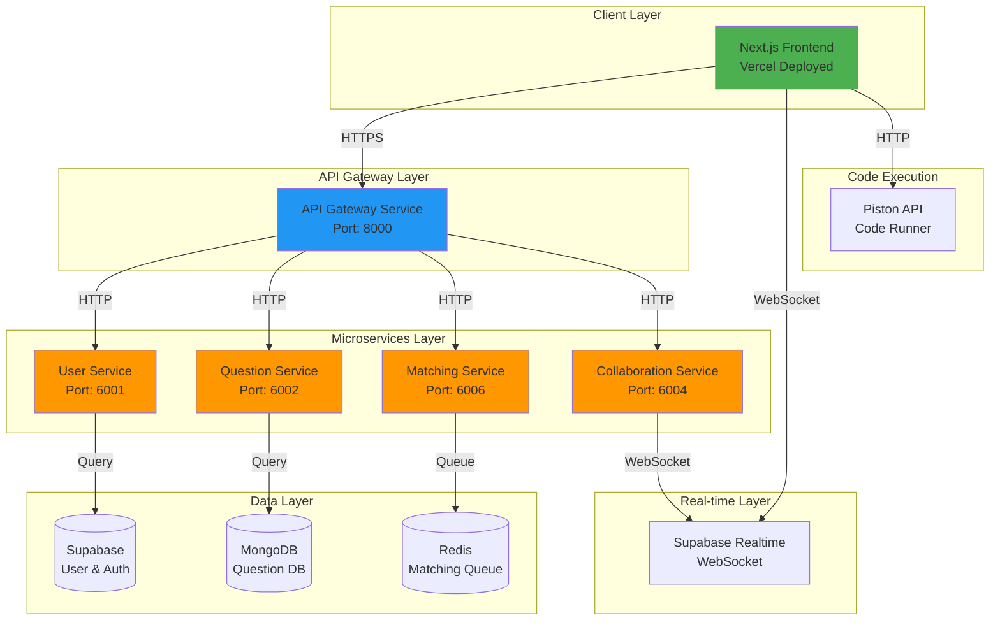

---

## 2. Collaboration Flow Diagram

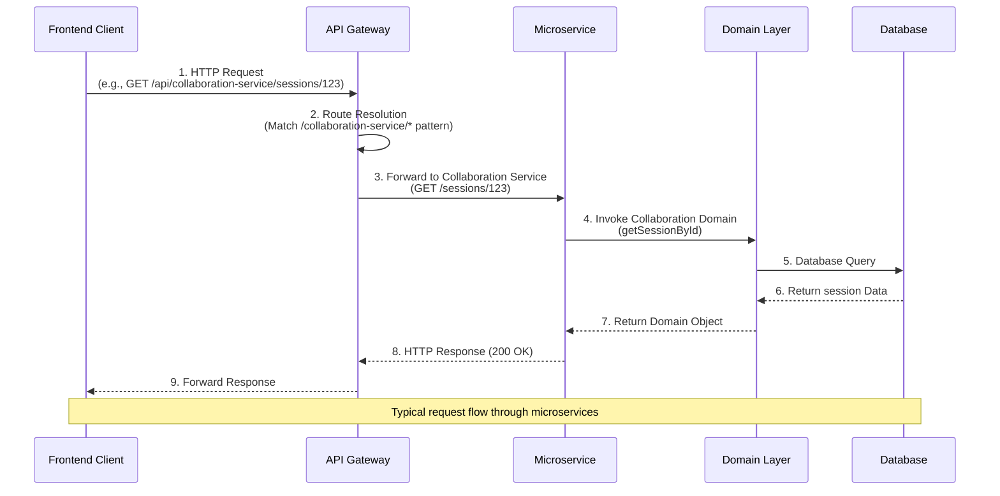

---

## 3. Question Service Architecture

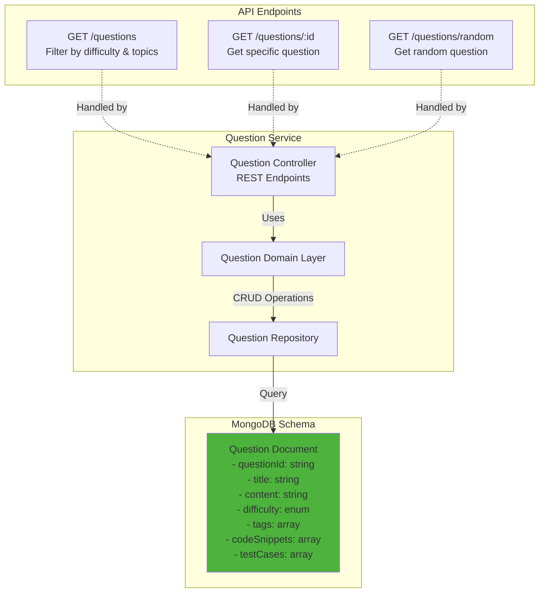

**Database Choice Justification:**

- **MongoDB** chosen for flexible schema to store arrays (tags, codeSnippets, testCases)
- Allows nested objects for language-specific code snippets
- Easy querying with filters (difficulty, tags)
- Horizontal scaling capabilities for large question banks

---

## 4. Matching Service Architecture

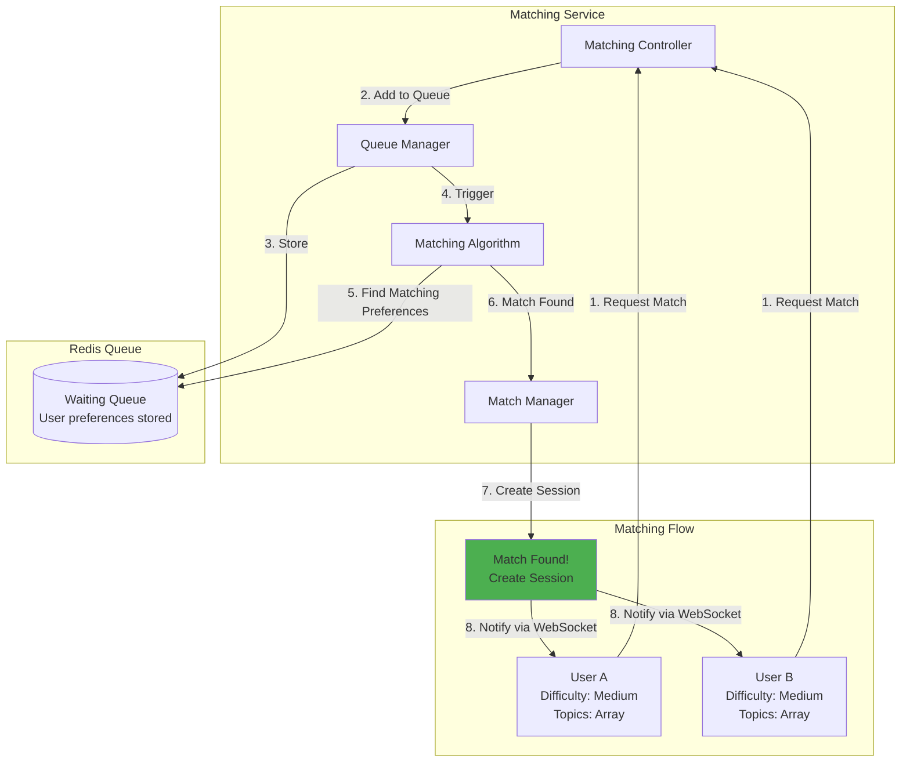

**Matching Algorithm:**

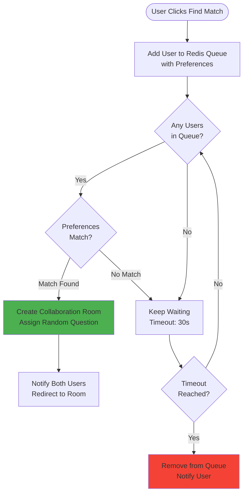

**Edge Cases Handled:**

- No matches available → Timeout after 30s
- Simultaneous requests → Redis atomic operations
- User disconnects → Remove from queue
- Duplicate requests → Check existing queue entry

---

## 5. Collaboration Service Architecture

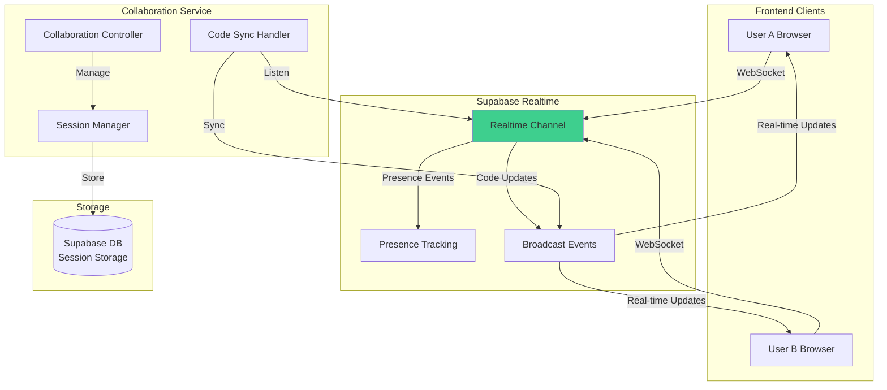

**Real-time Collaboration Flow:**

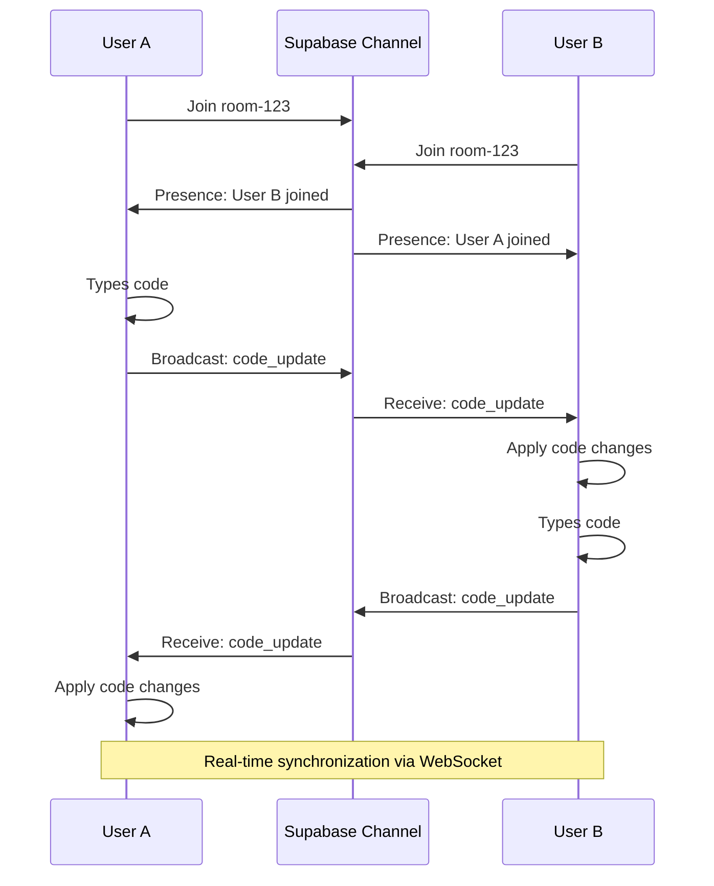

**Technology Stack:**

- **Supabase Realtime** (WebSocket-based)
- **Presence API** for user tracking
- **Broadcast API** for code synchronization
- **CodeMirror** for collaborative editing

---

## 6. Database Architecture

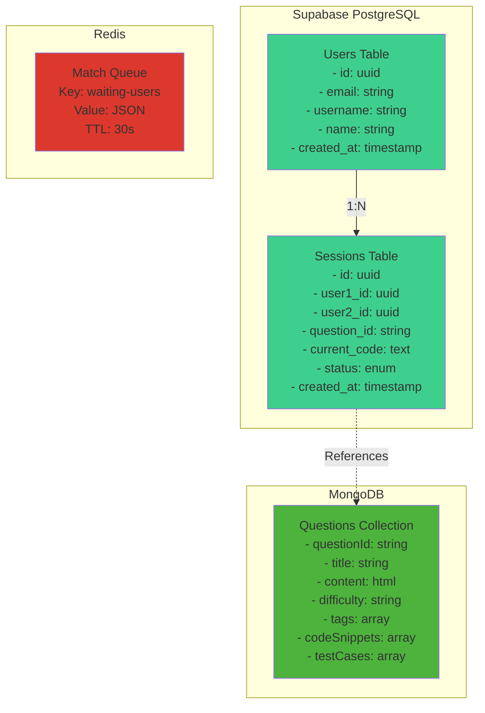

---

## 7. CI/CD Pipeline

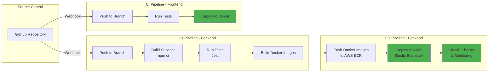

**Current CI/CD Status:**

- ✅ **Backend**: Build + Test automation (User & Question services)
- ✅ **Frontend**: Automated deployment to Vercel
- 🔄 **Planned**: Docker image push to AWS ECR
- 🔄 **Planned**: Automated deployment to AWS Elastic Beanstalk

---

## 8. Deployment Architecture

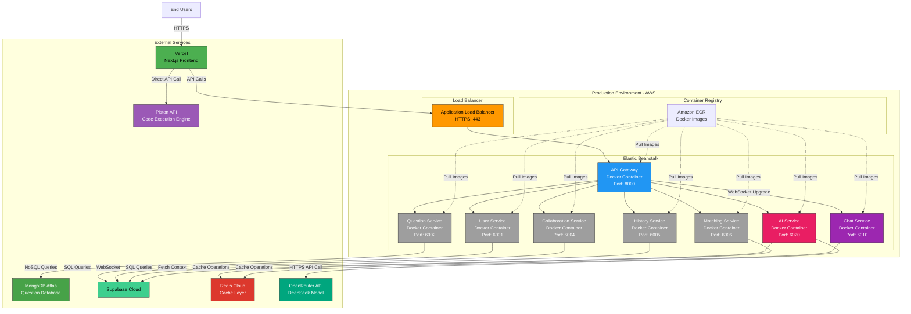

**Why AWS Elastic Beanstalk?**

1. **Simplified Container Orchestration**: Automatically handles Docker deployment
2. **Auto-scaling**: Scales based on traffic
3. **Load Balancing**: Built-in ALB for distributing requests
4. **Easy Rollback**: Version management for deployments
5. **Cost-Effective**: Pay only for resources used
6. **Integration**: Works seamlessly with ECR, CloudWatch
7. **Monitoring**: Built-in health monitoring

---

## 9. Sequence Diagrams

### 9.1 Complete User Matching Flow

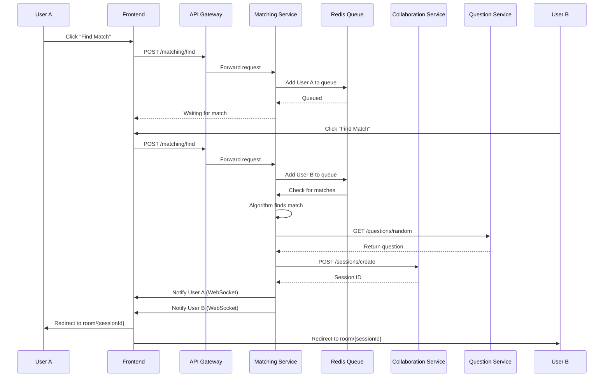

### 9.2 Real-time Code Collaboration

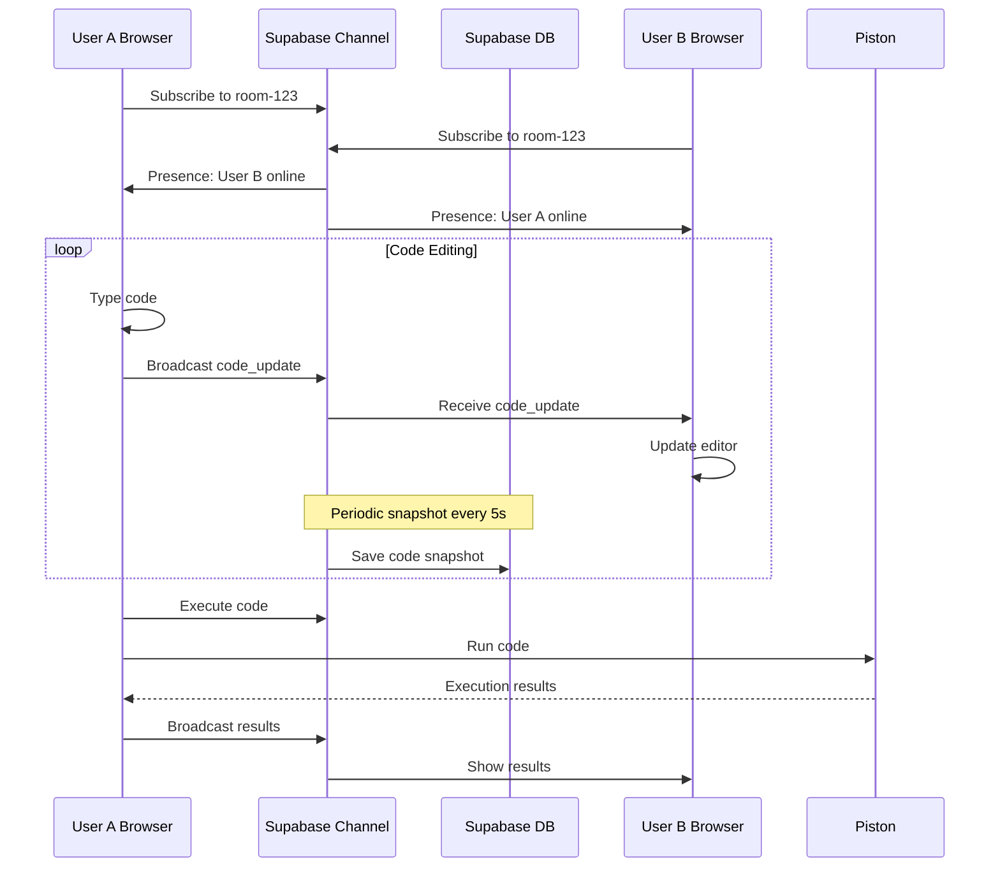

### 9.3 Question Retrieval Flow

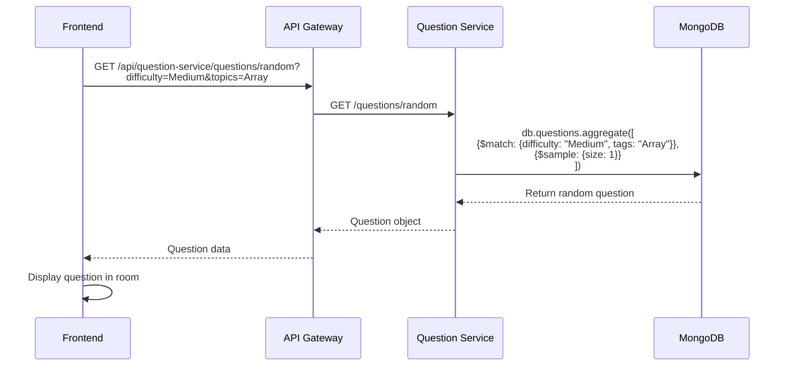

---

## Summary of Architecture Decisions

### 1. **Question Service**

- **Database**: MongoDB for flexible schema
- **Integration**: REST API via API Gateway
- **Scaling**: Horizontal scaling with MongoDB sharding

### 2. **Matching Service**

- **Algorithm**: Queue-based with preference matching
- **Edge Cases**: Timeout, duplicates, disconnections
- **Integration**: Redis queue + WebSocket notifications

### 3. **Collaboration Service**

- **Technology**: Supabase Realtime (WebSocket)
- **Real-time**: Code synchronization, presence tracking
- **Scaling**: Supabase handles WebSocket connections

### 4. **Service Containerization**

- **Approach**: Docker + AWS Elastic Beanstalk
- **CI/CD**: GitHub Actions → Build → Test → Push → Deploy
- **Monitoring**: CloudWatch logs, health checks

### 5. **Nice-to-Have Features**

- Code execution (Piston API)
- Language-specific code templates
- Execution history tracking
- Real-time collaboration indicators

---

## How to Use These Diagrams

1. **Copy Mermaid code** to https://mermaid.live
2. **Export as PNG/SVG** for your presentation
3. **Include in documentation** (GitHub renders Mermaid natively)
4. **Use for mentor meetings** to explain architecture
